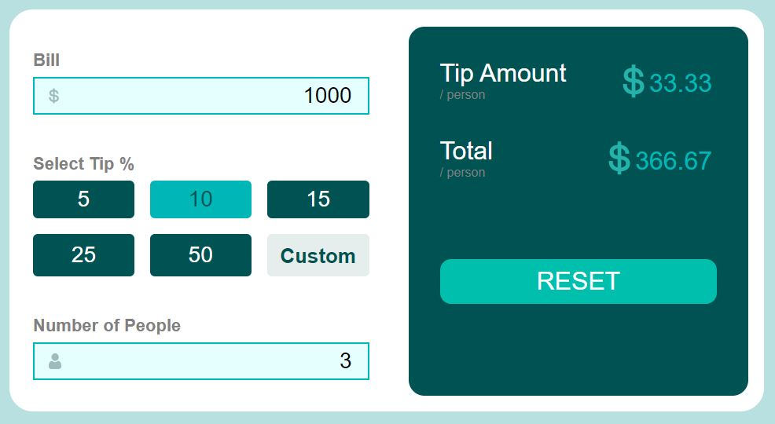

# React Mini Projects

# challange 1

file structure:
─── card-laptop
            ├── CardInitial.jsx
            │
            └── CardLaptop.jsx

- 

# challange 2

file structure:
tip-calculator
  - section-left
    - Bill.jsx
    - People.jsx
    - Tip.jsx
  - section-right
    - AmountTotal.jsx

- 