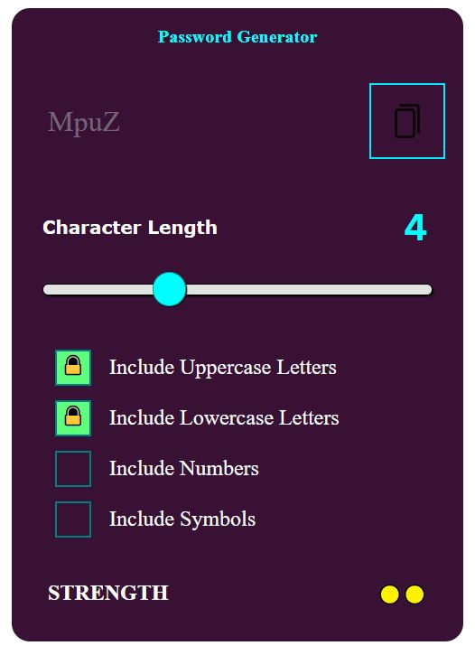
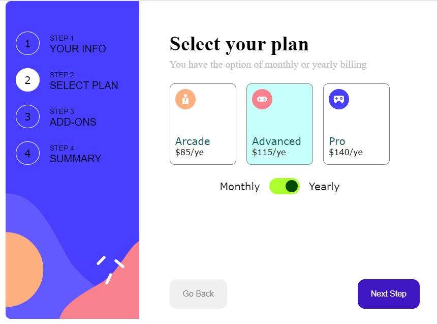

# React Mini Projects

# challange 1

file structure:

card-laptop

- CardInitial.jsx
- CardLaptop.jsx

- 

# challange 2

file structure:

tip-calculator

- section-left
  - Bill.jsx
  - People.jsx
  - Tip.jsx
- section-right

  - AmountTotal.jsx

- 

# challange 3

file structure:

pass-gen

- PassGen.jsx

- 

# challange 4

file structure:

multi-step-form

- MultiStepForm.jsx

  - PersonalInfo.jsx
  - SelectPlan.jsx
  - AddOns.jsx
  - FinishingUp.jsx
  - TheEnd.jsx

- 
